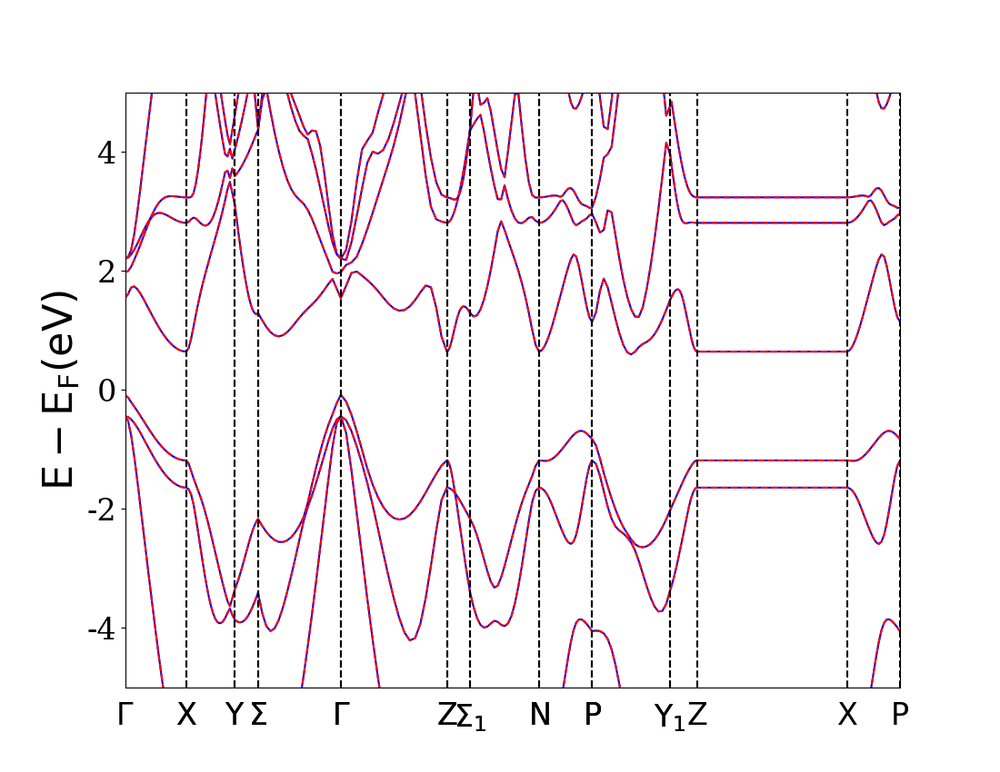

# Part 6: Automating VASP jobs with MPInterfaces

A lot of the work you did in writing and reading files from the Si relaxation is stuff that a computer can do. Below you will see how to use MPInterfaces to automatically launch and analyze VASP calculations.

----------

## Configuring MPInterfaces
You already installed MPInterfaces a while ago, but you might not have actually configured it with your system's settings. MPInterfaces is a tool that will set up and launch VASP jobs for you based on some reasonable default INCAR & KPOINTS parameters. The only thing it can't do is predict which structure you want to study, since that would require telepathy. Before it can launch jobs for you, though, it needs to know a few things about you. This is not a one-way relationship, after all.

You need to edit the mpint_config.yaml file that came with MPInterfaces to contain your settings. To find where this file is, start an ipython session:

```
$ ipython
In [1]: from mpinterfaces import PACKAGE_PATH
In [2]: print(PACKAGE_PATH)
/home/mashton/software/MPInterfaces/mpinterfaces
In [3]: exit
```
It should say something similar to that. Type

```
$ cp /home/mashton/software/MPInterfaces/config_files/mpint_config.yaml /home/mashton/software/MPInterfaces/mpinterfaces/
```
Obviously, replace my paths with your own and then we'll edit the version of the configuration file under /home/mashton/software/MPInterfaces/mpinterfaces/ with the following (use vim or emacs to edit the file):

```
username: # your UF HPC username
mp_api: # your Materials Project API key. You can find your API key at https://materialsproject.org/open
normal_binary: /home/mashton/vasp.5.4.1/bin/vasp # /path/to/std/vasp/
executable. You are probably okay putting /home/mashton/vasp.5.4.1/bin/vasp
twod_binary: /home/mashton/vasp.5.4.1/bin/vasp_noz  # /path/to/2D/vasp/executable
vdw_kernel: /home/mashton/vasp.5.4.1/vdw_kernel.bindat  # /path/to/vdw_kernel.bindat file. Leave as null if the kernel is hard-coded into VASP. Ask the VASP manager in the group about this.
potentials: /home/mashton/POTCARS  # /path/to/your/POTCAR/files
queue_system: slurm
queue_template: config_files/
```

Now you're ready to use MPInterfaces to submit jobs.

## Launching a basic relaxation
Let's test out MPInterfaces for relaxing silicon. Go to your scratch (`cd /ufrc/hennig/your_username`) and make a new directory called `Si_mpinterfaces`. Copy the POSCAR file from `Si_test` to `Si_mpinterfaces`, and then go into Si_MPInterfaces. The easiest way to use MPInterfaces for launching jobs is to use ipython. So start an ipython session:

```
$ ipython
In [1]: from mpinterfaces.mat2d.stability.startup import relax
In [2]: relax(dim=3)
In [3]: exit
```
Check out your directory now- it has a POTCAR, KPOINTS, INCAR, and runjob created for you automatically. In fact, MPInterfaces already sent the job to the queue for you. You can check on its status with `squeue -u your_username` just like before. It's okay if the input files look a little different from the ones you made in Si_test earlier. By the way, the `dim=3` option is to let MPInterfaces know that you're relaxing a bulk material and not a 2D material, which needs to be handled differently.

## Launching a band structure calculation

Once the relaxation has finished, check your job.log to make sure everything ran okay. The CONTCAR file might be a little different from the one in `Si_test` because you used slightly different input parameters, but they shouldn't be too different.

Now that we have the optimized structure, we can use it to accurately calculate the electronic band structure of silicon. Of course, the world already knows that silicon is an indirect semiconductor, but we can still verify that with a VASP calculation. In the future, we will calculate the band structures of new materials, so for now it's good to benchmark against a material where we know what the bands should look like.

To get an accurate band structure, we need a different INCAR from the one we used for the relaxation, and we will also want to use different KPOINTS.  Everything else will be the same. MPInterfaces will handle all of this for us if you go into `Si_mpinterfaces` and do the following, after it has finished relaxing:

```
$ ipython
In [1]: from mpinterfaces.mat2d.electronic_structure.startup import run_pbe_calculation
In [2]: run_pbe_calculation(dim=3)
In [3]: exit
```
You should see that you now have a directory called `pbe_bands` inside of `Si_mpinterfaces`, and inside of `pbe_bands` there is a POSCAR, KPOINTS, INCAR, POTCAR and runjob. Take a look at the INCAR and KPOINTS files to see how they are different from the INCAR and KPOINTS for the relaxation calculation.

This calculation should also not take very long to run. Once it has finished, we can plot the band structure, also using MPInterfaces. From inside `pbe_bands`, run the following:

```
$ ipython
In [1]: from mpinterfaces.mat2d.electronic_structure.analysis import plot_band_structure
In [2]: plot_band_structure()
In [3]: exit
```
Now there should be a PDF file called band_structure.pdf inside of `pbe_bands`. Download this file to your computer by typing the following on a terminal running for your own computer (not logged onto Hipergator):

```
$ scp your_username@hpg2.rc.ufl.edu:/ufrc/hennig/your_username/Si_mpinterfaces/pbe_bands/band_structure.pdf /downloads/folder/or/similar/location
```
and then open the PDF file however you normally would. It should look like this:



You can see that the band structure you calculated shows an indirect band gap from Gamma to a point near X. That's exactly what we were hoping for. If you're very keen, you'll also notice that the band gap we just calculated for silicon is much lower than its actual band gap (1.1 eV). This is a well-known problem with the theory behind VASP, and there are ways to improve on thisby performing more demanding calculations that take much longer than the one we just ran. If you really feel like it, you can run one of these more accurate calculations for silicon using MPInterfaces by substituting `run_pbe_calculation` with `run_hse_calculation` in the code snippet above. The `plot_band_structure()` function will work the same way for this calculation, which will run in a directory called `hse_bands`.