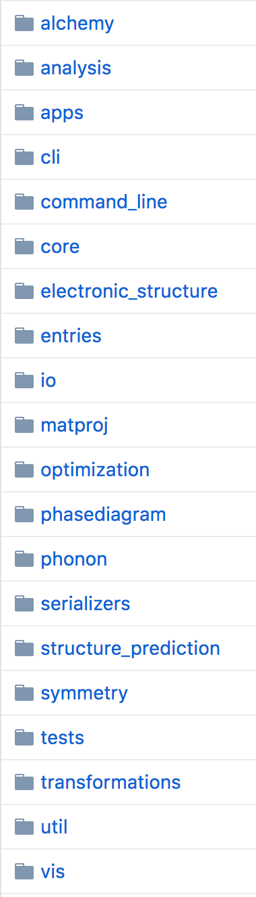

# Part 8: Using Pymatgen
[Previous](https://github.com/ashtonmv/Getting-Started/blob/master/objectives/Part_7.md) [Next](https://github.com/ashtonmv/Getting-Started/blob/master/objectives/Extras.md) 

Pymatgen is your friend! It was designed by people who are working on similar research projects to us, and it's a pretty well-tested piece of software. It can do a lot of things for you in a faster, cleaner and safer way than you could probably do it by hand. It's worth learning a little bit about how to use it now, while you're getting started on your research.

There's a lot of Pymatgen being used in MPInterface's [source code](https://github.com/henniggroup/mpinterfaces), so you've actually already been using Pymatgen without knowing it while doing some of the other objectives. Below is just a little more in-depth look at what Pymatgen can do on its own without MPInterfaces.

---------
## Pymatgen's coding structure
Open Pymatgen's [Github page](https://github.com/materialsproject/pymatgen). Click on "pymatgen" within its source code tree. This is where the real source code for Pymatgen is. You should get familiar with this page so you can reference it to check what functionalities are available in Pymatgen. We'll only go over a few here.

You can see that Pymatgen is divided into several modules:



You can browse through any of those modules to get an idea what they're created to do, but most of their names are pretty self-explanatory. The things that you'll probably use Pymatgen most often for are under **core** and **io**.

## The core module: Structure, Composition, Site, and Element objects
If you click on **core**, you'll see a bunch of `.py` files and a few `.json` files. `.json` files are files that store data in an efficient way for Python to read, and Pymatgen uses these files to store information about elements in the periodic table, and things like that.

The most important file in here is probably `structure.py`. If you open this file, you can see that it is quite long. There is only one real object in this file that we use often, and it's the `Structure` object defined by the line that begins with `class Structure`. You can find this line by <kbd>⌘</kbd> + <kbd>f</kbd>. This `Structure` object has many *methods* associated with it, all listed in its source code on Github, that you will find very useful for manipulating crystal structures. Some examples (Run the following from within the `Si_mpinterfaces` directory you created a while ago):

```shell
$ ipython
```
```python
# First, import the Structure class.
In [1]: from pymatgen.core.structure import Structure
# Create a Structure object by reading in
# a POSCAR file.
In [2]: structure = Structure.from_file("POSCAR")

# Count the number of atoms in a Structure.
In [3]: print(structure.num_sites)
2

# Make a supercell.
In [4]: structure.make_supercell([2, 2, 2])
In [5]: print(structure.num_sites)
16

# Write the Structure object to a POSCAR file .
In [6]: structure.to(filename="POSCAR-supercell", fmt="POSCAR")

# Revert to unit cell structure.
In [7]: structure = structure.get_primitive_structure()

# Loop through the sites of the Structure.
# Each site is an instance of the Site class
# defined in pymatgen/core/sites.py, so they
# have their own attributes and methods:
In [8]: for site in structure.sites:
   ...:     print(site.coords)  # cartesian
[ 1.367182  1.367182  1.367182]
[ 0.  0.  0.]
   ...:     print(site._fcoords)  # fractional
[0.25, 0.25, 0.25]
[0.0, 0.0, 0.0]
   ...:     print site.specie
Si
Si

# Get the composition of the Structure.
In [9]: print(structure.composition)
Si2
# Technically, structure.composition creates
# a Composition object, which is defined
# in pymatgen/core/composition.py. 
# So it has its own methods and attributes:
In [10]: composition = structure.composition
In [11]: print(composition.reduced_formula)
Si

# Within a Composition object, there are Element
# objects, which are defined under
# pymatgen/core/periodic_table.py.
In [12]: for element in composition:
  ...:     print(element.oxidation_states)
(-4, -3, -2, -1, 1, 2, 3, 4)
  ...:     print(element.atomic_radius)
1.1 ang
  ...:     print(element.is_transition_metal)
False

In [13]: exit
```

Hopefully you've gotten a taste of how useful the Structure object is in Pymatgen.

## The io module: Incar, Kpoints, and Vasprun objects
Pymatgen has powerful classes for other VASP files, too. These are under `pymatgen/io/vasp/inputs.py` and `outputs.py`. Under `inputs.py`, you'll find the Incar and Kpoints objects. These are useful for creating the INCAR and KPOINTS files. Here's how they work:

```shell
$ ipython
```
```python
In [1]: from pymatgen.io.vasp.inputs import Incar, Kpoints

# Create an INCAR file based on a Python dictionary.
In [2]: incar_dict = {
   ...:     "PREC": "Accurate",
   ...:     "PREC": "Accurate",
   ...:     "PREC": "Accurate",
   ...:     "PREC": "Accurate",
   ...:     "PREC": "Accurate",
   ...: }
In [3]: incar = Incar.from_dict(incar_dict)
In [4]: incar.write_file("INCAR_test")

# It's usually most useful to create a Kpoints
# object based on a Structure object.
In [5]: from pymatgen.core.structure import Structure
In [6]: structure = Structure.from_file("POSCAR")

# An automatic k-mesh based on a uniform grid is
# useful for relaxations.
In [7]: kpoints = Kpoints.automatic_density(structure, kppa=1000)  # kppa = kpoints per atom
In [8]: kpoints.write_file("KPOINTS_uniform")

# By importing the HighSymmKpath class from
# pymatgen/symmetry/bandstructure.py, you can
# also create KPOINTS files that have
# high-symmetry paths useful for band structure
# calculations.
In [9]: from pymatgen.symmetry.bandstructure import HighSymmKpath
In [10]: kpath = HighSymmKpath(structure)
In [11]: linemode_kpoints = Kpoints.automatic_linemode(divisions=20, kpath)
In [12]: linemode_kpoints.write_file("KPOINTS_linemode")
In [13]: exit
```
The Vasprun object is defined inside of `outputs.py`. This is actually probably the single most useful object in Pymatgen, since the vasprun.xml stores essentially all of the information about your run. Using a Vasprun object, you can access the Structure objects based on your initial POSCAR and final CONTCAR structures, your kpoints, all of your incar parameters, the POTCAR you used, etc. You can even get the final energy of your calculation, along with the band structure and fermi energy you calculated. Here are some examples of how to use the Vasprun object:

```shell
$ ipython
```
```python
In [1]: from pymatgen.io.vasp.outputs import Vasprun
In [2]: vasprun = Vasprun("vasprun.xml")

# Get the final relaxed Structure object
# from your calculation.
In [3]: final_structure = vasprun.final_structure
In [4]: print(final_structure.num_sites)
2

# Get the final energy from your calculation.
In [5]: print(vasprun.final_energy)
-5.64300767 eV
In [6]: print(vasprun.final_energy / final_structure.num_sites)  # energy per atom
-2.821503835 eV

# Get the fermi energy from your calculation.
In [7]: print(vasprun.efermi)
4.98156419

# Get a Kpoints object based on the KPOINTS
# file used in your calculation.
In [8]: kpoints = vasprun.kpoints
In [9]: kpoints.write_file("KPOINTS_from_vasprun")

# Get an Incar dictionary based on the INCAR
# file used in your calculation.
In [10]: incar = vasprun.incar
In [11]: print(incar["PREC"])
accurate

# Get the band structure (a BandStructure object,
# defined in pymatgen/electronic_structure/bandstructure)
# from your pbe_bands calculation.
In [12]: cd pbe_bands  # yes, you can use cd in ipython!
In [13]: pbe_vasprun = Vasprun("vasprun.xml")
In [14]: band_structure = pbe_vasprun.get_band_structure()
In [15]: from pymatgen import Spin
In [16]: print(band_structure.bands[Spin.up])
[[ -6.405   -6.1679  -5.489  ...,  -5.7089  -5.7082  -5.6947]
 [  4.5798   2.7789   0.4011 ...,   1.0837   1.0264   0.9643]
 [  4.5798   4.2375   3.7191 ...,   3.5481   3.7452   3.8354]
 ...,
 [  7.2313   7.6673   8.1947 ...,   8.1136   8.0851   8.0893]
 [  7.2313   8.7092  11.1121 ...,  10.2511  10.4096  10.5377]
 [ 11.8153  11.4475  11.9706 ...,  11.4094  11.5737  11.6697]]
In [17]: exit
```
[Previous](https://github.com/ashtonmv/Getting-Started/blob/master/objectives/Part_7.md) [Next](https://github.com/ashtonmv/Getting-Started/blob/master/objectives/Extras.md)